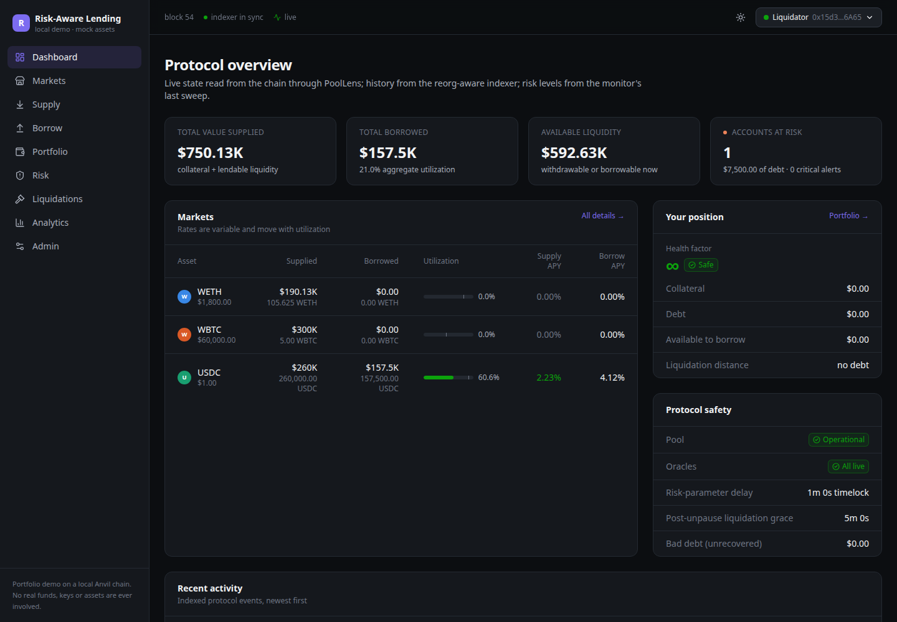
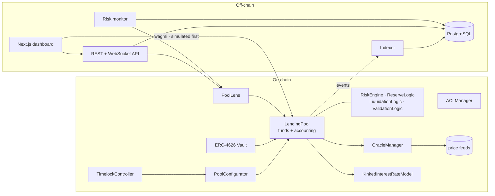
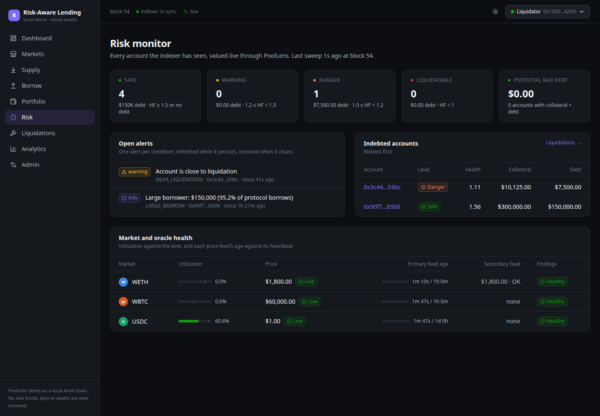
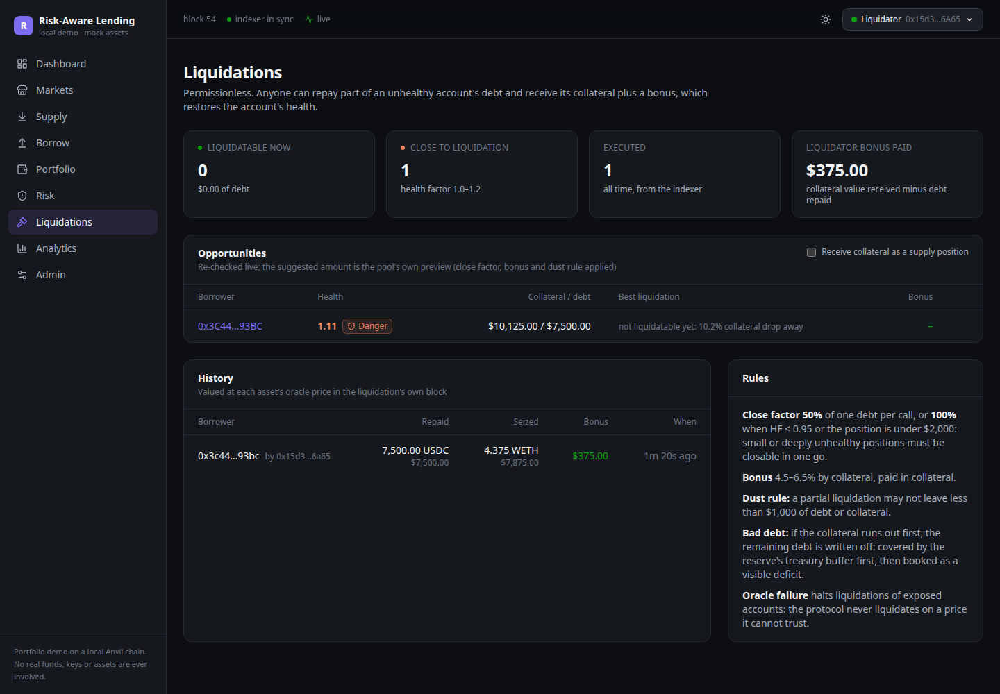

# Risk-Aware Lending Protocol

An over-collateralised lending and borrowing protocol, built the way a production one is built: Aave-style
index accounting, a kinked interest-rate model, a fail-closed oracle layer, permissionless liquidations
with explicit bad-debt handling, timelocked governance — plus the off-chain half that real protocols
need, an event-driven indexer with reorg handling, a REST/WebSocket API, a risk monitor, and a dashboard.

> **Demo project. No real money, ever.** Mock ERC-20s, mock (or testnet) price feeds, Anvil's public test
> keys. It has not been audited. Everything runs locally; a public testnet deployment is optional and
> gated by safety checks in the deploy script.

```bash
git clone --recurse-submodules https://github.com/pranay123-stack/risk-aware-lending-protocol
cd risk-aware-lending-protocol

scripts/demo.sh        # Foundry only: chain + protocol + the full 12-step scenario
docker compose up      # or the whole stack, UI included: http://localhost:3400
```

---



## What it does

| | |
|---|---|
| **Markets** | WETH, WBTC, USDC, each with its own LTV, liquidation threshold, bonus, reserve factor, caps, rate model and oracle configuration |
| **Supply / withdraw** | interest-bearing deposits; withdrawals bounded by liquidity and, for collateral backing debt, by borrowing capacity |
| **Borrow / repay** | variable-rate borrowing on index accounting; repay is possible even while the protocol is paused |
| **Interest** | kinked (two-slope) curve per market; borrowers compound, suppliers accrue linearly, and the difference stays in the reserve |
| **Risk engine** | health factor, borrow capacity, max borrow / withdraw, liquidatable check, max liquidation amount, bonus |
| **Oracles** | Chainlink-compatible feeds with heartbeat, bounds, incomplete-round and invalid-answer checks, an optional independent second source with a deviation check, and a guardian circuit breaker. **Fails closed** |
| **Liquidations** | permissionless, 50% close factor (100% when deeply unhealthy or small), dust rule, `receiveSupply` option, same-asset support, grace period after unpause |
| **Bad debt** | recognised in the same transaction, absorbed by the treasury buffer first, the rest booked as an explicit, coverable `deficit`. Never hidden, never socialised silently |
| **ERC-4626 vault** | a passive-lender wrapper with inflation-attack protection and liquidity-aware limits |
| **Governance** | OpenZeppelin `TimelockController` for everything risk-increasing; an instant guardian for everything risk-reducing |
| **Off-chain** | indexer (confirmations, reorg rollback, exactly-once), REST + WebSocket API with OpenAPI, risk monitor with SAFE/WARNING/DANGER/LIQUIDATABLE alerts, Next.js dashboard with wallet support |

## Numbers

| | |
|---|---|
| Solidity | ~2,800 lines across 23 production contracts and libraries (plus mocks for local runs) |
| Tests | **211 Foundry tests** (195 unit, 6 fuzz suites, 10 invariants) + 12 gas benchmarks + 62 TypeScript tests + a browser click-through |
| Invariant campaign | 1.54M handler calls in the deep profile: **46,290 liquidations, 1,874 bad-debt write-offs, 0 failures** |
| Coverage | 96.9% lines, 95.1% functions (unit + fuzz, production contracts) |
| Static analysis | Slither: **0 High**; the 14 Medium findings are each triaged as intentional in [docs/security.md](docs/security.md#5-static-analysis). `forge lint` clean |
| Gas | supply 83.6k · borrow 169k · repay 92.7k · liquidate 244k (isolated, full transaction cost) |
| `LendingPool` | 18,169 bytes, 6.4 KB under the EIP-170 limit |

## Architecture



Four ideas carry most of the design:

**1. Scaled balances, lazily accrued.** Balances are stored divided by an index. Interest is applied to
the index, not to every account, so accrual is O(1) and exact to the second. Borrowers compound (3-term
Taylor series of `e^x`), suppliers accrue linearly, and every rounding decision favours the protocol.

**2. Internal cash accounting.** The pool never reads `balanceOf(pool)`. Available liquidity is a tracked
counter, so a token donation cannot move an index, a rate or a share price — the bug class behind several
empty-market exploits.

**3. A bitmap per account.** Two bits per reserve (borrowing, collateral). Valuation walks only the
markets an account actually uses, which bounds gas *and* isolates markets: a broken WBTC feed cannot
freeze an account that holds no WBTC.

**4. Fail closed, asymmetrically.** Anything that needs a price (borrow, collateral withdrawal with debt,
liquidation) reverts when that price can't be validated. Anything that only reduces risk (supply, repay,
debt-free withdrawal) never reads a price at all, so an oracle incident can't trap lenders.

## The demo scenario

`scripts/demo.sh` runs the brief's twelve steps against a fresh chain and prints the state read back from
it. The heart of it:

| | |
|---|---|
| Bob posts **10 WETH** at $2,500 and borrows **15,000 USDC** | capacity $20,000 (80% LTV), `HF = 25,000 × 82.5% / 15,000 = 1.375` |
| ETH falls to **$1,800** on both feeds | collateral $18,000, `HF = 0.99` → liquidatable |
| A liquidator repays **7,500 USDC** (50% close factor) | receives **4.375 WETH** ($7,875): a **$375** bonus |
| Bob keeps 5.625 WETH against 7,500 USDC | `HF = 1.114` — the liquidation *restored* his health |

If ETH instead gaps to $1,400, the collateral ($14,000) no longer covers the debt: the liquidator takes
all 10 WETH for 13,333.33 USDC, and the remaining **1,666.67 USDC is written off** in the same
transaction — treasury buffer first, remainder booked as an explicit deficit that anyone can cover.

## Running it

| Goal | Command | Needs |
|---|---|---|
| Contracts + scenario | `scripts/demo.sh` | Foundry |
| Everything, including the UI | `docker compose up --build` → http://localhost:3400 | Docker |
| Development | see [docs/deployment.md](docs/deployment.md#4-the-native-stack-for-development) | Foundry, Node 20, pnpm, Postgres |
| Tests | `make test` (contracts + TypeScript), `make test-deep`, `make gas` | |
| Static analysis | `make slither`, `forge lint`, `make fmt` | Slither |

The dashboard has pages for markets, supply, borrow, portfolio, risk, liquidations, analytics and an
admin console (timelock proposals, emergency controls, and an **oracle lab** for simulating staleness,
deviation and outages). Locally it offers one-click Anvil dev wallets — the accounts are unlocked on the
node, so no private key ever reaches the browser — and every transaction is simulated before signing,
with custom errors decoded into plain language.

### Screens

| | |
|---|---|
|  |  |
| **Risk monitor** — every indexed account valued live, alerts reconciled while a condition persists, and each feed's age against its heartbeat. | **Liquidations** — live opportunities with the pool's own preview (close factor, bonus, dust rule) and history valued at each liquidation's own block. |

## Documentation

| | |
|---|---|
| [architecture.md](docs/architecture.md) | design of record: components, storage model, lifecycles, and the alternatives that were rejected |
| [economics.md](docs/economics.md) | reserve balance sheet, the rate model, supply-rate derivation, every market parameter and why |
| [risk-model.md](docs/risk-model.md) | valuation, LTV vs liquidation threshold, derived quantities, off-chain risk levels |
| [oracles.md](docs/oracles.md) | validation pipeline, failure modes, circuit breakers, what fails closed |
| [liquidations.md](docs/liquidations.md) | close factor, dust rule, the `LT × (1 + bonus) < 1` proof, and [bad debt](docs/liquidations.md#bad-debt) |
| [security.md](docs/security.md) | protection-by-protection review, [why unrestricted admin access is dangerous](docs/security.md#admin), Slither triage, limitations |
| [threat-model.md](docs/threat-model.md) | actors, assets, 40 catalogued threats, attack trees |
| [testing.md](docs/testing.md) | the test pyramid, invariant handler design, campaign statistics, and [every bug testing found](docs/testing.md#bugs-found) |
| [gas-report.md](docs/gas-report.md) | measured costs, optimisations with before/after, contract sizes |
| [api.md](docs/api.md) | REST + WebSocket reference, conventions, the risk monitor |
| [deployment.md](docs/deployment.md) | local, Docker, native, operations, and optional testnet safety |

## Repository layout

```
contracts/        core/ logic/ oracle/ interest/ periphery/ libraries/ interfaces/ mocks/
script/           Deploy.s.sol · Demo.s.sol · ShowState.s.sol · lib/ (MarketConfig, ProtocolDeployer)
test/             unit/ fuzz/ invariant/ gas/ fork/ helpers/
shared/           TS: ray/wad maths, risk classification, DB access, migrations
indexer/          TS: log polling, confirmations, reorg rollback, typed persistence
backend/          TS: Fastify API, WebSocket hub, risk monitor, OpenAPI spec
frontend/         Next.js 16 + wagmi dashboard
e2e/              puppeteer click-through of the running stack
docker/           Dockerfile + idempotent deploy entrypoint
docs/             the documents above
```

## Honest limitations

No external audit and no formal verification. No flash loans (the requirements to add them safely are
documented). No L2 sequencer-uptime check, which a rollup deployment would need. No insurance module
behind the deficit. No isolation or efficiency mode. Contracts are deliberately **not** upgradeable, so
migration is the upgrade path. Fee-on-transfer and rebasing tokens are unsupported by design. The API has
no rate limiting and expects a reverse proxy in front. Full list:
[security.md](docs/security.md#7-known-limitations-and-future-work).

## License

MIT.
