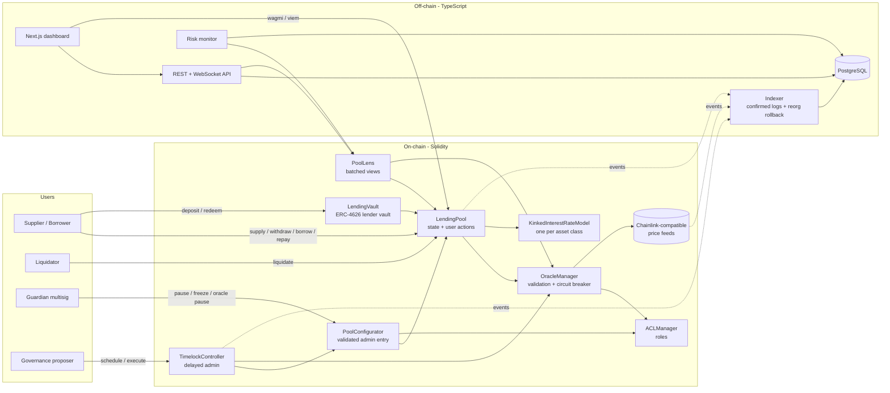
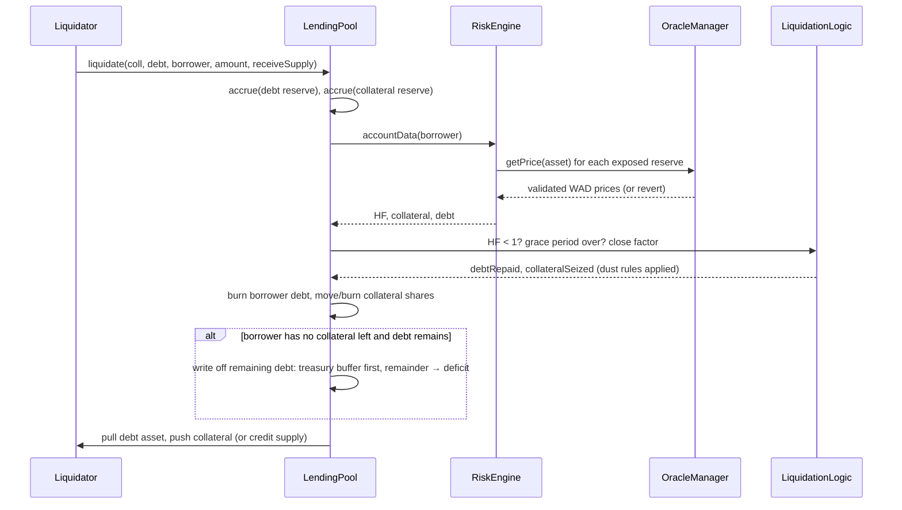
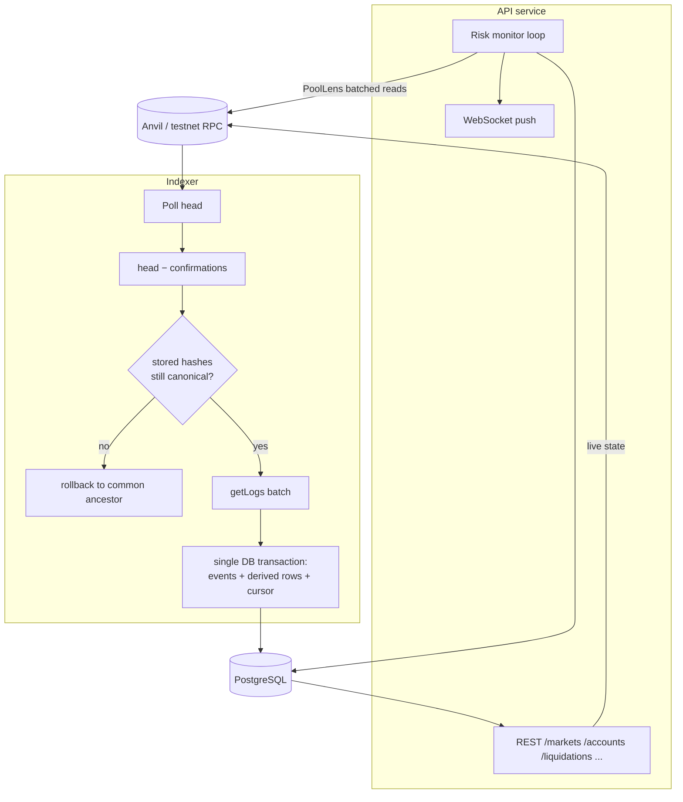

# Architecture

This document is the design of record. It was written before the first contract (phase 1) and
revised as implementation proved or disproved parts of it. Where the final code deviates from the
suggested architecture in the brief, the reason is recorded under **Design decisions**.

---

## 1. System overview



## 2. Contract responsibilities

| Brief's suggested component | Implemented as | Kind |
|---|---|---|
| LendingPool | `core/LendingPool.sol` | contract: the only holder of user funds and accounting state |
| ReserveManager | `logic/ReserveLogic.sol` + `core/PoolConfigurator.sol` | library (accrual, rates, cash) + contract (listing, parameter validation) |
| InterestRateModel | `interest/KinkedInterestRateModel.sol` | contract, immutable parameters, one deployment per asset class |
| RiskEngine | `logic/RiskEngine.sol` | library: account valuation, health factor, borrow capacity |
| LiquidationEngine | `logic/LiquidationLogic.sol` | library: close factor, seizure math, dust rules, bad-debt write-off |
| OracleManager / PriceOracle | `oracle/OracleManager.sol` over `AggregatorV3Interface` feeds | contract; `mocks/MockAggregator.sol` locally |
| AccessController | `core/ACLManager.sol` (OpenZeppelin `AccessControl`) | contract: single role registry every component queries |
| Emergency / pause | pause/freeze flags in `LendingPool`, guardian role, oracle asset pause, post-unpause liquidation grace period | distributed |
| Governance delay | OpenZeppelin `TimelockController` | contract, owns every risk-increasing permission |
| (added) Lens | `periphery/PoolLens.sol` | stateless views that never revert on one bad account |
| (added) ERC-4626 | `periphery/LendingVault.sol` | passive lender vault wrapping a pool supply position |

### Why libraries and not separate contracts for RiskEngine / LiquidationEngine

The risk engine and liquidation engine need to read and write the pool's storage — every user's
scaled balances, bitmaps and reserve indexes. Making them separate contracts would force one of two
bad options:

1. **External calls back into the pool** for every balance read. Each costs a cold `CALL` plus ABI
   encoding. On a liquidation that touches 3 reserves that is ~20 extra calls.
2. **Storage-sharing via `delegatecall` proxies.** This is the Diamond pattern: storage-collision
   risk, and a much larger audit surface for a portfolio-size codebase.

Libraries give the same separation of *source* and *responsibility* with none of the runtime cost.
Every risk decision still lives in exactly one file (`RiskEngine.sol`), and `LendingPool` never
computes a health factor itself.

**Implementation note.** That last escape hatch was needed: `LendingPool` reached 23,986 bytes, 590
under the EIP-170 limit. `LiquidationLogic.executeLiquidation` is now an `external` library function,
deployed once and reached by `DELEGATECALL`, so it still runs on the pool's storage and emits from the
pool's address. The pool is 18,169 bytes. The cost is about 2.6k gas per liquidation; no other action is
affected. Its amount maths stayed `internal` and `pure`, so `PoolLens` inlines the same code for
previews. This is the split Aave v3 ships.

### Why a separate PoolConfigurator

`LendingPool` exposes minimal, unvalidated setters callable **only** by the configurator. All
parameter validation (LTV ≤ LT, LT × (1 + bonus) < 100%, decimals match the token, caps) lives in
`PoolConfigurator`. This keeps the pool's bytecode small. It also makes the admin surface auditable
in one place, and lets the admin contract be replaced without migrating user funds.

## 3. Storage model

All accounting is **internal**. The pool never reads `token.balanceOf(address(this))` for
accounting. Available liquidity is a tracked `cash` variable. A direct token donation therefore
cannot move an index, a utilization figure or a share price. This is the class of bug behind the
Hundred Finance and Radiant empty-market exploits. Aave v3.1 added `virtualUnderlyingBalance` for
the same reason.

### Per reserve (`DataTypes.ReserveData`) — 7 storage slots

```
slot 0  ReserveConfig (packed, 240 bits)
        ltv:u16 | liquidationThreshold:u16 | liquidationBonus:u16 | reserveFactor:u16 |
        decimals:u8 | active | frozen | paused | borrowingEnabled | collateralEnabled |
        supplyCap:u64 (whole tokens) | borrowCap:u64 (whole tokens)
slot 1  liquidityIndex:u128 (ray)        | variableBorrowIndex:u128 (ray)
slot 2  currentLiquidityRate:u128 (ray/yr)| currentBorrowRate:u128 (ray/yr)
slot 3  totalScaledSupply:u128           | totalScaledDebt:u128
slot 4  cash:u128 (virtual balance)      | accruedToTreasury:u128 (scaled)
slot 5  deficit:u128 (unbacked bad debt, underlying units)
slot 6  interestRateModel:address | lastUpdateTimestamp:u40 | id:u16
```

The hot path of an action reads slots 0–4 and 6 and writes 1, 2, 3, 4 and 6. Fields written
together share a slot, so one action costs one `SSTORE` per slot, not per field.

### Per user

```
mapping(address user => mapping(uint256 reserveId => UserReserve)) // {scaledSupply:u128, scaledDebt:u128}
mapping(address user => uint256) userConfig                        // 2 bits per reserve
```

`userConfig` is a bitmap: bit `2i` = borrowing reserve `i`, bit `2i+1` = reserve `i` enabled as
collateral. Account valuation iterates only over reserves whose bits are set, and stops as soon as
the remaining bitmap is zero. A user with one supply and one borrow costs two price reads, not
`MAX_RESERVES`. This matters for gas, and also for **market isolation**: an account with no WBTC
exposure never calls the WBTC oracle, so a broken WBTC feed cannot freeze it.

## 4. Index-based interest accounting

Balances are stored **scaled** (divided by an index at the time of the action). They are never
updated per block:

```
supplyBalance(user) = scaledSupply(user) × liquidityIndex(now)       (rounded down)
debtBalance(user)   = scaledDebt(user)   × variableBorrowIndex(now)  (rounded up)
```

On every state-changing action the touched reserve is **accrued** first. The indexes are moved from
`lastUpdateTimestamp` to `block.timestamp` using the rates stored at the previous action:

```
liquidityIndex      ← liquidityIndex      × (1 + liquidityRate × Δt / YEAR)         linear
variableBorrowIndex ← variableBorrowIndex × (1 + r·Δt + (r·Δt)²/2 + (r·Δt)³/6)      compounded (3-term Taylor)
```

After the action changes cash and debt, **rates are recomputed** from the new utilization and
stored for the next interval. Views compute "normalized" indexes on the fly, so they are exact
without a write.

The liquidity rate is **derived from what borrowers actually pay**. It is not the textbook formula
applied blindly:

```
liquidityRate = borrowRate × (1 − reserveFactor) × totalDebt / totalSupplyLiabilities
```

With no deficit and no rounding residue, `totalSupplyLiabilities = cash + totalDebt`, so this equals
the textbook `borrowRate × U × (1 − RF)`. The general form guarantees one thing: **interest credited
to suppliers never exceeds interest charged to borrowers**, even when a deficit exists. The textbook
formula would, in that case, credit interest on unbacked supply and grow the hole.

Reserve-factor income is accrued as a scaled treasury balance (`accruedToTreasury`) during index
accrual:

```
debtAccrued       = totalScaledDebt × (newBorrowIndex − oldBorrowIndex)
accruedToTreasury += debtAccrued × reserveFactor / newLiquidityIndex
```

It stays in the pool as the reserve's first-loss buffer. See **Bad debt** below.

### Rounding policy — always in favour of the protocol

| Operation | Rounding | Effect |
|---|---|---|
| supply → scaled minted | down | supplier gets ≤ their deposit |
| withdraw → scaled burned | up | supplier burns ≥ their withdrawal |
| borrow → scaled debt minted | up | borrower owes ≥ what they took |
| repay → scaled debt burned | down | borrower clears ≤ what they paid |
| balance of supply | down | claims are never overstated |
| balance of debt | up | debts are never understated |
| collateral valuation | down | risk is never understated |
| debt valuation | up | risk is never understated |
| borrow index growth | up / liquidity index growth | down |

The fuzz suite asserts that no sequence of supply/withdraw or borrow/repay round trips extracts
even one wei (`test/fuzz/RoundingFuzz.t.sol`).

## 5. User lifecycle

```mermaid
stateDiagram-v2
    [*] --> Supplier: supply()
    Supplier --> Collateralized: setUseReserveAsCollateral(true)<br/>(automatic on first own supply)
    Collateralized --> Borrower: borrow() while debt ≤ LTV capacity
    Borrower --> Borrower: repay() / supply() / accrue interest
    Borrower --> AtRisk: price falls or interest accrues<br/>HF < 1
    AtRisk --> Borrower: liquidate() restores HF ≥ 1<br/>or user repays / adds collateral
    AtRisk --> BadDebt: collateral exhausted, debt remains
    BadDebt --> Settled: debt written off → reserve deficit
    Borrower --> Collateralized: repay(max)
    Collateralized --> Supplier: setUseReserveAsCollateral(false)
    Supplier --> [*]: withdraw(max)
```



### Supply

1. `nonReentrant`; validate: amount > 0, reserve active, not paused/frozen, supply cap.
2. Accrue reserve.
3. `scaled = amount.rayDivDown(liquidityIndex)`; revert if it rounds to zero (dust protection).
4. Update user and total scaled supply and `cash += amount`.
5. First supply **by the owner themselves** auto-enables collateral. Supplying *on behalf of*
   another address never does. Otherwise anyone could force exposure to a fragile asset onto a
   victim and brick the victim's borrows whenever that asset's oracle trips (griefing vector).
6. Recompute rates → `ReserveDataUpdated`.
7. `safeTransferFrom(caller → pool)` last (CEI; a failed transfer reverts everything).

### Withdraw

1. Validate: active, not paused, `amount ≤ balance`, `amount ≤ cash` (liquidity constraint).
2. Accrue; burn `amount.rayDivUp(index)` (full balance burns exactly all shares).
3. If the reserve is enabled as collateral **and** the user has debt: the post-withdraw debt must be
   ≤ the LTV-weighted borrowing capacity. The check is **LTV, not HF ≥ 1**. A withdrawal must never
   leave a position at the liquidation edge. If the user has no debt, no price is read, so an
   oracle outage never traps lenders' funds.
4. Recompute rates; transfer out.

### Borrow

1. Validate: active, not paused/frozen, borrowing enabled, `amount ≤ cash`, borrow cap.
2. Accrue; mint `amount.rayDivUp(borrowIndex)` scaled debt; set the borrowing bit.
3. Risk check: `debtValue_after ≤ Σ collateralValue_i × LTV_i`. Since `LTV < LT` for every asset,
   this implies HF ≥ LT/LTV > 1 right after the borrow.
4. Recompute rates; transfer out.

### Repay

1. Allowed while paused. Repaying only ever lowers risk, and accrual continues during a pause.
2. Accrue; `payback = min(amount, debt)`; burn `payback.rayDivDown(index)`, or all shares when
   paying the full debt; clear the borrowing bit at zero.
3. Recompute rates; `safeTransferFrom(payer → pool)`.

## 6. Liquidation lifecycle



- **Close factor** 50%, rising to 100% when HF < 0.95 or the position is smaller than $2,000.
  Small positions must be fully liquidatable, or they become unprofitable dust that turns into
  bad debt.
- **Seizure**: `collateral = debtRepaid × P_debt / P_coll × (1 + bonus)`, capped by the borrower's
  balance, in which case `debtRepaid` is recomputed downward.
- **Dust rule**: a partial liquidation may not leave less than $1,000 of debt *or* collateral. The
  liquidator must take the whole position instead.
- **receiveSupply**: the liquidator can take collateral as a supply position instead of the
  underlying. Without this, liquidations fail whenever the collateral reserve is 100% utilized,
  which is exactly when they matter most.
- **Grace period**: for a configurable window after unpause, liquidations are blocked so borrowers
  can repay interest that accrued while repayment of other assets was impossible.

Full maths and edge cases: [liquidations.md](liquidations.md).

## 7. Bad debt

When a liquidation leaves a borrower with **zero collateral across every collateral reserve** and
debt remains, that debt can never be repaid. The pool recognises it immediately and does not let it
accrue interest as a zombie liability:

1. For each reserve the borrower owes: burn the scaled debt.
2. Absorb the loss from that reserve's `accruedToTreasury` buffer first.
3. Record any remainder in `reserve.deficit`, emit `BadDebtRecognized`.
4. Anyone (treasury, insurance fund) can call `coverDeficit(asset, amount)` to recapitalise.

The solvency invariant becomes `cash + totalDebt + deficit ≥ totalSupplyLiabilities`. Losses are
never hidden. Indexes never decrease, so the loss is not socialised automatically. That is a
deliberate choice, analysed with the alternatives in [liquidations.md](liquidations.md#bad-debt).

## 8. Oracle lifecycle

```
feed.latestRoundData()
   → answer > 0, updatedAt ≠ 0, updatedAt ≤ now, now − updatedAt ≤ heartbeat
   → normalise feed decimals → 18-decimal USD
   → minPrice ≤ price ≤ maxPrice                      (catches min/maxAnswer clamping, e.g. LUNA)
   → if a secondary feed is healthy: |primary − secondary| / secondary ≤ maxDeviation
   → primary unhealthy + secondary healthy → use secondary (fallback)
   → both unhealthy / deviation / paused → REVERT (fail closed)
```

Fail-closed has **asymmetric consequences by design**:

| Action | Needs prices? | Behaviour when an exposed asset's oracle fails |
|---|---|---|
| supply, repay | no | works |
| withdraw with zero debt, or of non-collateral | no | works |
| withdraw collateral with debt, borrow, disable collateral | yes | reverts |
| liquidate | yes | reverts: never liquidate on a bad price |

Details and every failure mode: [oracles.md](oracles.md).

## 9. Governance and emergency controls

| Role | Holder (prod) | Holder (local demo) | Powers | Delay |
|---|---|---|---|---|
| `DEFAULT_ADMIN_ROLE` | Timelock | Timelock | grant/revoke roles | timelock |
| `POOL_ADMIN` | Timelock | Timelock | list reserves, risk params, caps, IRM, oracle config, reserve withdrawal, unfreeze | timelock |
| `EMERGENCY_ADMIN` | Guardian multisig | deployer EOA | pause/unpause pool and reserves, freeze reserves, pause an oracle asset | none |
| Timelock proposer | Governance multisig | deployer EOA | schedule operations | — |
| Timelock executor | anyone | anyone | execute after delay | — |

The principle is **risk-reducing actions are instant, risk-increasing actions are delayed.** A
compromised guardian can at worst freeze the protocol, which is recoverable: governance revokes the
role. A compromised proposer is visible on-chain for the whole delay, and the guardian can pause
while users exit. Why unrestricted admin access is dangerous, with historical incidents:
[security.md](security.md#admin).

## 10. Off-chain architecture



- **Source of truth split.** Live balances and health factors are read from the chain through
  `PoolLens`. They are never recomputed from indexed events, which would silently drift. The
  database holds **history**: events, rate and index snapshots, price history, liquidations, risk
  snapshots and timelock operations.
- **Exactly-once indexing.** Every batch's rows and the cursor advance commit in one Postgres
  transaction, and rows are unique on `(tx_hash, log_index)`. A crash at any point replays the
  batch harmlessly.
- **Reorgs.** Only blocks at `head − CONFIRMATIONS` are indexed, and their hashes are stored. Each tick
  re-verifies **the cursor block's** hash: because block hashes chain, a match at height N proves nothing
  at or below N changed, so one read replaces a scan. On mismatch the indexer walks stored blocks back to
  the highest one the chain still agrees with, deletes everything above it (FK cascade), and re-indexes
  from there. If no stored block agrees (a deep reorg, or a restarted chain), it re-indexes from the
  deployment's start block. A batch is also discarded if any log's block hash disagrees with the header
  fetched for that block, or if the cursor block was replaced while the batch was being built.
- **Risk monitor.** It periodically scans every known account through `PoolLens.getAccountsHealth`
  (one call for many accounts, try/catch per account) and classifies each one
  `SAFE / WARNING / DANGER / LIQUIDATABLE`. It also flags markets for high utilization, stale or
  deviating oracles, large positions and deficits. Alerts are persisted and pushed over WebSocket.

## 11. Design decisions (and rejected alternatives)

| Decision | Alternative rejected | Why |
|---|---|---|
| Pool holds funds, internal `cash` | aToken/cToken holds funds, `balanceOf` accounting | donation-proof; one place to audit |
| Non-transferable supply positions + separate ERC-4626 vault | transferable rebasing aTokens | transferable collateral needs HF checks on every transfer. The vault gives composability for passive lenders without putting collateral transfers on the attack surface |
| Immutable IRM contracts, swapped via timelock | mutable params in one contract | params are auditable at an address; a swap is one explicit, delayed, accrued-before event |
| LTV check on withdraw (Compound) | HF ≥ 1 check (Aave) | a withdrawal must not park a position on the liquidation edge |
| View-only oracle validation with a cross-source check | stateful "last good price" breaker | no extra `SSTORE` per action and no keeper dependency; the deviation check needs two independent sources, which is what defends against manipulation anyway |
| Deficit accounting | automatic socialisation (index cut) | indexes stay monotonic (a core invariant), losses stay explicit and attributable |
| OZ `TimelockController` | custom timelock | audited, standard tooling; every admin change becomes an indexed on-chain proposal |
| `ReentrancyGuardTransient` | classic `ReentrancyGuard` | same guarantee, EIP-1153 transient storage, measured ~1.9k gas cheaper per call (docs/gas-report.md) |
| No flash loans in v1 | Aave-style flash loans | out of scope. Documented as future work together with the extra invariants they require |

## 12. What changed after phase 1

This document was written before the first contract. Where implementation disagreed with the plan, the
plan lost. The substantive changes:

| Change | Why |
|---|---|
| `LiquidationLogic.executeLiquidation` became an **external** (linked) library | EIP-170: the pool was 590 bytes from the limit ([gas-report.md](gas-report.md)) |
| Liquidation **captures prices during valuation** instead of re-reading the oracle | one validated price per asset per transaction: −13.7k gas, and no chance of valuing with one price and seizing with another |
| `ReserveLogic.treasuryScaledNow()` added, and every view routed through it | the solvency views omitted treasury interest accrued since the last interaction. Found by the invariant suite (bug #2 in [testing.md](testing.md#bugs-found)) |
| Compounded interest reworked to a Taylor series on `x = r·Δt` | the binomial form truncated its cubic term and under-charged borrowers (bug #1) |
| `LiquidationParams` lost its `liquidator` field; the library uses `msg.sender` | removes an arbitrary-send shape Slither (correctly) flagged, rather than arguing it is unreachable |
| The risk monitor **reconciles** alerts (partial unique index on open `(kind, subject)`) instead of appending | a condition that persists for a hundred sweeps is one alert, resolved automatically when it clears |
| `PoolLens` max-withdraw rewritten to mirror the pool's exact condition | the lens and the pool disagreed during an oracle outage (bug #5) |
| `Deploy.s.sol` asserts the governance handover on-chain | a deployment that leaves the deployer with a role now fails instead of shipping |
| The API's `effectiveNow = max(head timestamp, wall clock)` | on an idle local chain the head block can be hours old, which made staleness checks lie (bug #9) |
