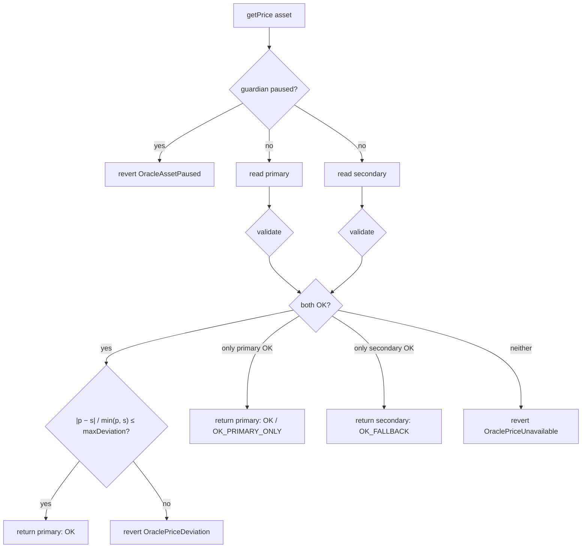

# Oracles

The price oracle decides which positions may borrow, which may be liquidated, and how much collateral a
liquidator receives. A wrong price is the fastest way to drain a lending protocol, so the oracle layer
is built to **fail closed**. When it is unsure, it refuses to price, and every action that needs a price
stops until it is sure again.

Implementation: [`contracts/oracle/OracleManager.sol`](../contracts/oracle/OracleManager.sol).
Tests: [`test/unit/OracleManager.t.sol`](../test/unit/OracleManager.t.sol) (24 tests) plus the
oracle cases in `Emergency.t.sol` and `Liquidation.t.sol`, and the optional mainnet-fork test.

---

## 1. Threats this layer is designed against

| Incident class | What happened | Defence here |
|---|---|---|
| **Spot-price manipulation** (e.g. Mango Markets, 2022) | the attacker pumped a thin market's spot price, then borrowed against the inflated collateral | no DEX spot or pool-derived prices are ever used; only push-based aggregator feeds, read through `AggregatorV3Interface` |
| **Donation-inflated prices** (e.g. Cream Finance, 2021) | a share token's price came from `balanceOf`, and a donation doubled it | no price is derived from a balance anywhere; pool accounting ignores donations entirely ([security.md](security.md)) |
| **TWAP manipulation on thin liquidity** (e.g. Inverse Finance, 2022) | a short-window DEX TWAP was moved over a few blocks | no on-chain TWAPs; cross-source deviation check |
| **Feed clamped at `minAnswer`** (LUNA collapse, 2022: Venus, Blizz) | the aggregator kept reporting its floor price while the market traded far below it, so borrowers posted worthless LUNA at the floor price | per-asset `[minPrice, maxPrice]` sanity band set inside the plausible range: a price at the clamp reads `OUT_OF_BOUNDS` and fails closed |
| **Stale feed** | the network or the feed stalled and the last answer stayed "valid" | per-feed heartbeat; an answer older than it reads `STALE` |
| **Broken or deprecated feed** | the feed reverts, returns 0, a negative value, or an incomplete round | each case is detected and reported, and the other source can take over |
| **Single-source compromise** | one provider is wrong | optional independent secondary feed; disagreement beyond `maxDeviationBps` reverts |
| **Operator error** | wrong feed address or decimals configured | decimals read from the feed at configuration time; config is timelocked; bounds reject wildly wrong scales |

## 2. Validation pipeline

Per-feed validation (`_readFeed`), applied in this order:

| Check | Status if it fails | Why |
|---|---|---|
| call does not revert (`try/catch`) | `CALL_FAILED` | a deprecated, access-controlled or wrong-address feed must not brick the other source |
| `0 < answer ≤ 2¹²⁸` | `INVALID_ANSWER` | zero and negative prices are nonsense; the upper bound makes normalisation overflow-free |
| `updatedAt ≠ 0` | `INCOMPLETE_ROUND` | a round that never completed |
| `updatedAt ≤ block.timestamp` | `FUTURE_TIMESTAMP` | a malformed or malicious feed |
| `block.timestamp − updatedAt ≤ heartbeat` | `STALE` | boundary inclusive (`test_heartbeatBoundaryIsInclusive`) |
| `minPrice ≤ normalised ≤ maxPrice` | `OUT_OF_BOUNDS` | clamped feeds, decimal misconfiguration, obvious glitches |

Prices are normalised to 18 decimals from whatever the feed reports (0 to 36 decimals, fuzz-tested).
For a `STALE` or `OUT_OF_BOUNDS` read, the raw price is still returned by `getPriceState`, so monitoring
can show what the feed is saying even though the protocol refuses to use it.

**Deviation is measured against the lower price**, the stricter of the two symmetric choices. A 3%
tolerance on WETH means the two feeds may differ by at most 3% of the smaller one. The rule is symmetric
in which feed is higher (`testFuzz_deviationIsSymmetric`).

## 3. Two entry points

| Function | Reverts? | Used by |
|---|---|---|
| `getPrice(asset)` | **yes**, on anything other than `OK`, `OK_PRIMARY_ONLY`, `OK_FALLBACK` | the pool: every price-dependent action |
| `getPriceState(asset)` | never | `PoolLens`, the API, the risk monitor and the dashboard (per-feed status, age, both prices) |

The split matters. Monitoring must keep working during exactly the incidents it exists to report, and
the protocol must never act on a price it could not validate.

## 4. What fails closed, and what keeps working

Fail-closed has **asymmetric consequences by design**:

| Action | Needs a price? | When an exposed asset's oracle fails |
|---|---|---|
| supply, repay | no | works. Repaying during an outage only lowers risk |
| withdraw with zero debt, or from a non-collateral reserve | no | works. Lenders are never trapped by an oracle |
| ERC-4626 vault deposit and redeem | no | works. The vault never borrows |
| borrow, collateral withdraw with debt, disabling collateral with debt | yes | reverts |
| liquidate | yes | reverts. **The protocol never liquidates on a bad price** |

Only accounts **exposed** to the failing asset are affected (market isolation,
[risk-model.md](risk-model.md#1-account-valuation)). An outage in the WBTC feed leaves every account
without WBTC exposure fully functional (`test_oraclePause_isolatedToExposedAccounts`).

The price of that choice is that liquidations of exposed accounts pause during an outage, and bad debt
could accrue if the market moves meanwhile. That is the right trade-off. Liquidating on a stale or
manipulated price is a certain loss for borrowers who did nothing wrong. A short delay is only a
possible loss, and suppliers are protected by the LT buffer and the treasury buffer. After the guardian
un-pauses the *pool*, a configurable **liquidation grace period** (300 s locally, 30 min by default
elsewhere, max 4 h) gives borrowers time to top up before liquidators can act.

## 5. Circuit breakers

| Mechanism | Who | Effect |
|---|---|---|
| **Cross-source deviation** | automatic | primary and secondary disagree beyond `maxDeviationBps` → `DEVIATION` → revert |
| **Sanity bounds** | automatic | price outside `[minPrice, maxPrice]` → `OUT_OF_BOUNDS` → that source is unusable |
| **Staleness** | automatic | older than the heartbeat → `STALE` |
| **Asset oracle pause** | guardian (`EMERGENCY_ADMIN`), instant | every `getPrice` for that asset reverts. Used when a feed is wrong but still "valid", e.g. during a depeg that the bounds do not catch |
| **Pool / reserve pause, freeze** | guardian, instant | see [security.md](security.md#emergency-controls) |

Reconfiguring an asset's feeds (`setAssetOracle`, timelocked) preserves an active guardian pause
(`test_reconfigureDoesNotLiftPause`). A governance change must not silently lift an emergency brake.

### Why there is no stored "last good price" breaker

A common design stores the last accepted price and rejects moves larger than X% from it. It was rejected
here for three reasons:

1. **It freezes the market during every genuine crash.** A 25% ETH drop in an hour is exactly when
   liquidations must run. A last-good-price breaker blocks them, and the protocol accrues bad debt while
   it waits.
2. **It adds an SSTORE to every price-dependent action**, plus a keeper to advance the stored price
   during quiet periods.
3. **It does not defend against the real threat.** A manipulated or broken single source moves no
   differently from a real crash when you only look at that source. What detects it is a second,
   **independent** source that disagrees, which is the deviation check.

`OracleManager` is therefore entirely `view`: no state is written on the price path.

### Why no on-chain TWAP

A DEX TWAP is only as strong as the liquidity behind it. For long-tail collateral it can be moved over
a few blocks for less than the value it unlocks. For deep markets the push-based aggregators are both
more robust and simpler. A TWAP could be added as a *secondary* source through the same
`AggregatorV3Interface` adapter shape, where it would act as a manipulation cross-check rather than the
price of record.

## 6. Configuration

| | WETH | WBTC | USDC |
|---|---|---|---|
| Primary | 8-decimal feed, heartbeat 1 h | 8-decimal feed, 1 h | 8-decimal feed, 24 h |
| Secondary | independent 18-decimal feed, 1 h, max deviation 3% | none | none |
| Bounds (USD) | 100 – 1,000,000 | 1,000 – 10,000,000 | 0.50 – 2.00 |

Configuration rules enforced by `setAssetOracle`: the primary must be set; `0 < heartbeat ≤ 2 days`;
`0 < minPrice < maxPrice`; feed decimals ≤ 36; a secondary must differ from the primary and needs its own
heartbeat and a deviation of at most 20%; without a secondary, the secondary heartbeat and deviation must
be zero. Every failure mode has a test (`test_revert_invalidConfigs`).

**USDC is priced, not assumed.** Hard-coding stablecoins at $1 hides a depeg from the risk engine. If
USDC trades at $0.90 but counts as $1.00, anyone can buy it at a discount, post it as collateral and
borrow real assets against value that is not there. Here a depeg flows into every health factor
immediately. The bounds (`$0.50 – $2.00`) only catch feed failures, not market moves.

## 7. Local and testnet feeds

**Local (`FEEDS_MODE=mock`, the default).** Every feed is a
[`MockAggregator`](../contracts/mocks/MockAggregator.sol) owned by the deployer. It implements the full
`AggregatorV3Interface`, emits Chainlink's `AnswerUpdated` / `NewRound` events (so the indexer records
price history exactly as it would for a real feed), and exposes test controls: `setAnswer`,
`setAnswerWithTimestamp`, `setIncompleteRound`, `setReverting`, `poke`. The Admin page's **Oracle lab**
drives these to demonstrate crashes, staleness, deviation and outages from the UI.

Mock feeds go stale after their heartbeat just like real ones. On a long-running local stack, the risk
monitor process runs a small **MockPriceKeeper**
([`backend/src/monitor/priceKeeper.ts`](../backend/src/monitor/priceKeeper.ts)) that re-posts each
mock's *current* answer once half its heartbeat has elapsed. It never changes a price, refuses to run
on any chain other than 31337, and only touches feeds its key owns. It measures age against
`max(head block time, wall clock)`: on an idle auto-mining Anvil the head block can be hours old, while
the next transaction is mined at wall-clock time. That was a real bug found by running the stack (bug #7
in [testing.md](testing.md#bugs-found)).

**Public testnet (`FEEDS_MODE=chainlink`, optional).** Pass the testnet's Chainlink feed addresses as
`ETH_USD_FEED`, `BTC_USD_FEED` and `USDC_USD_FEED`. Take them from Chainlink's official data-feeds
directory for your network, never from a third-party list. Tokens remain mocks. No secondary feed is
configured, because a mock secondary owned by the deployer would let the deployer veto the real feed.
**Check each feed's actual heartbeat** in the Chainlink directory and adjust `MarketConfig` if it
differs from the values above, or the market will read `STALE` between updates. See
[deployment.md](deployment.md#optional-public-testnet).

**L2 note.** On an optimistic or ZK rollup, a production deployment must also check Chainlink's
**sequencer uptime feed**. While the sequencer is down, prices can't update and L1-forced transactions
can exploit stale values. Neither the local chain nor Sepolia needs it, so it is listed under future work
in [security.md](security.md#known-limitations-and-future-work).

## 8. Test coverage

| Behaviour | Test |
|---|---|
| decimals 0, 8, 18, 36 and fuzzed | `test_getPrice_normalizesEightDecimalFeed`, `test_decimalNormalization_*`, `testFuzz_decimalNormalization` |
| stale primary → fallback; both stale → revert; inclusive boundary | `test_stalePrimary_fallsBackToSecondary`, `test_revert_bothStale`, `test_heartbeatBoundaryIsInclusive`, `test_revert_stalePrimaryOnly` |
| zero / negative / huge answers | `test_invalidAnswers_areRejected`, `test_answerAbove2to128_isRejectedNotOverflowed` |
| future timestamp, incomplete round | `test_futureTimestamp_isRejected`, `test_incompleteRound_isRejected` |
| reverting feed is contained | `test_revertingPrimary_isContainedAndFallsBack`, `test_revert_totalOracleDowntime` |
| bounds | `test_outOfBounds_isRejected` |
| deviation | `test_deviationWithinTolerance_isAccepted`, `test_revert_deviationBeyondTolerance`, `testFuzz_deviationIsSymmetric` |
| guardian breaker | `test_guardianPause_haltsReads`, `test_reconfigureDoesNotLiftPause`, `test_revert_strangerCannotPause` |
| access control and config validation | `test_revert_nonAdminCannotConfigure`, `test_revert_invalidConfigs`, `test_revert_unconfiguredAsset` |
| pool behaviour under outage | `test_oraclePause_isolatedToExposedAccounts`, `test_oraclePause_haltsLiquidationOfExposedAccounts`, `test_revert_liquidationWhenOracleDeviates`, `test_maxWithdraw_matchesPoolDuringOracleOutage` |
| real Chainlink feeds (read-only mainnet fork, optional) | `test/fork/ChainlinkFork.t.sol`, skipped unless `MAINNET_RPC_URL` is set |
