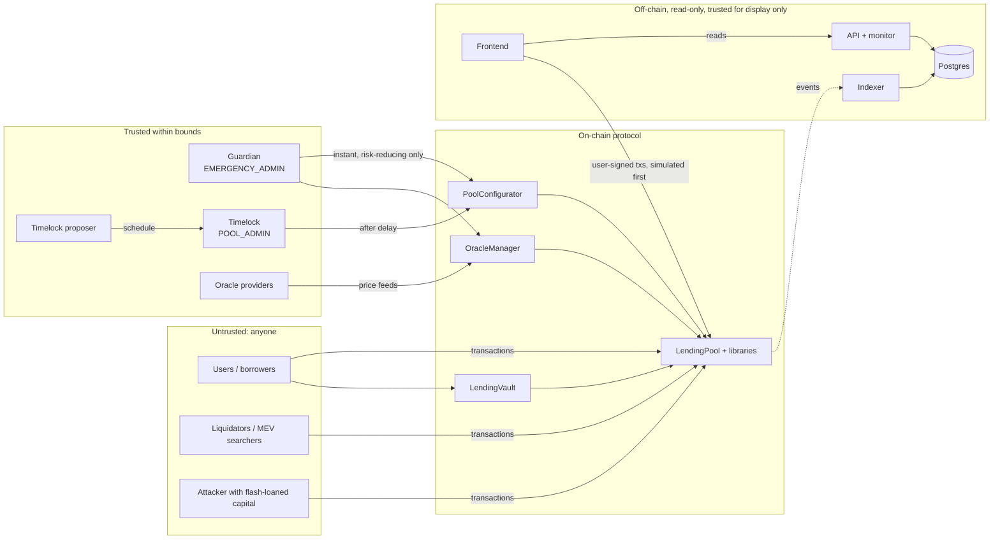

# Threat model

Who might attack the system, what they want, what they can do, and where each attack stops. The
mechanisms themselves are explained in [security.md](security.md); this document is the catalogue that
drove them.

---

## 1. System and trust boundaries



**The on-chain protocol is the only component that holds or moves funds.** The off-chain stack has no
key that controls the protocol. The API and the monitor can only read. The local-only price keeper can
re-post an unchanged mock price. A compromised off-chain stack can therefore show wrong information, but
it cannot move funds or change parameters.

## 2. Assets

| Asset | Why it matters |
|---|---|
| Supplier deposits (cash + claims on debt) | the funds at risk |
| Borrower collateral | seized unfairly = direct theft from borrowers |
| Treasury buffer | first-loss capital for bad debt |
| Correctness of indexes, rates, health factors | every other asset depends on them |
| Availability of exits (withdraw, repay) and of liquidations | users must be able to leave; the protocol must be able to stay solvent |
| Admin powers (timelock, guardian, proposer keys) | custody-equivalent ([security.md](security.md#admin)) |
| Integrity of displayed data (API, dashboard) | users make decisions on it |

## 3. Actors and capabilities

| Actor | Capabilities assumed | Goal |
|---|---|---|
| **Arbitrary attacker** | unlimited flash-loan capital within one transaction; deploys contracts; can call anything permissionless; sees the mempool | extract funds |
| **MEV searcher / block builder** | orders, inserts and censors transactions within a block; small timestamp influence (seconds) | extract value from ordering (liquidations, oracle updates) |
| **Malicious borrower** | a normal account with collateral | borrow more than collateral allows; avoid liquidation; leave bad debt |
| **Malicious liquidator** | holds debt assets | liquidate healthy accounts; seize more than allowed |
| **Griefer** | small capital, no profit motive | brick other users' accounts or the protocol |
| **Oracle provider failure** | a feed stalls, reverts, clamps, or reports a wrong value | (not malicious by assumption; failures must be contained) |
| **Compromised guardian key** | `EMERGENCY_ADMIN` powers | disrupt |
| **Compromised proposer key** | can schedule any timelocked call | seize control after the delay |
| **Compromised off-chain host** | controls API responses, the DB or frontend assets | mislead users into bad transactions |

**Trust assumptions.** (1) Listed tokens are standard ERC-20s. Listing is a timelocked governance
decision, and fee-on-transfer and rebasing tokens are not supported. (2) At least one configured price
source for each asset is honest and live most of the time. (3) The timelock proposer is not malicious,
or is watched. The delay plus the guardian contain it. (4) Ethereum's consensus and the EVM behave as
specified.

## 4. Threat catalogue

Likelihood and impact are rated for a production deployment. L = low, M = medium, H = high.

### Funds extraction

| ID | Threat | Vector | Impact | Mitigation | Residual |
|---|---|---|---|---|---|
| T1 | Borrow against inflated collateral | manipulate the collateral price (spot or TWAP) | H | push-based feeds only; bounds; secondary-feed deviation check ([oracles.md](oracles.md)) | L: requires compromising the feed provider itself |
| T2 | Donation or inflation to move an exchange rate | send tokens to the pool or vault; the first-depositor attack | H | internal `cash`; virtual-shares offset; zero-mint reverts | L |
| T3 | Rounding drain | repeat tiny operations that round in the user's favour | M | protocol-favouring rounding on every path; round-trip fuzzing | L |
| T4 | Reentrancy via token hook | a listed token with callbacks re-enters mid-action | H | CEI plus a shared transient lock | L |
| T5 | Withdraw collateral that backs debt | withdraw, or disable collateral, while indebted | H | LTV check on post-state, stricter than HF ≥ 1 | L |
| T6 | Borrow beyond capacity through intermediate state | multi-step sequences within one transaction | H | every check on post-state; invariant `borrowNeverExceedsCapacity` | L |
| T7 | Stale indexes used in valuation or liquidation | act before accrual | M | accrue-first on every action; views extrapolate to now | L |
| T8 | Pull funds from another user's allowance via liquidation | point the payer at a victim | H | the library uses `msg.sender`; no payer parameter exists | L |
| T9 | Treasury drained before bad debt | admin withdraws the buffer | M | `withdrawReserves` is timelocked and limited to the treasury's own claim | M: governance trust |

### Liquidation integrity

| ID | Threat | Vector | Impact | Mitigation | Residual |
|---|---|---|---|---|---|
| T10 | Liquidate a healthy account | call `liquidate` at HF ≥ 1 | H | strict HF < 1 check after accrual | L |
| T11 | Liquidate on a bad price | stale, deviating or paused feed | H | `getPrice` fails closed; liquidation reverts | L |
| T12 | Seize more than debt × (1 + bonus) | amount maths, decimals, rounding | H | one pure `calculateAmounts`, rounding against the liquidator, fuzzed bound | L |
| T13 | Snipe borrowers right after an emergency unpause | liquidate in the first block | M | grace period after unpause | L |
| T14 | Leave unliquidatable dust | partial liquidation to a tiny remainder | M | $1,000 dust rule, $2,000 full-close rule | L |
| T15 | Liquidation made impossible by illiquidity | collateral reserve at 100% utilization | M | `receiveSupply` needs no cash | L |
| T16 | Liquidation worsens solvency | parameters with LT × (1 + bonus) ≥ 1 | H | configurator rejects them; proof in [liquidations.md](liquidations.md#why-lt--1--bonus--1) | L |
| T17 | Liquidation MEV (backrunning oracle updates) | searchers race to liquidate | L | inherent to permissionless liquidation. The bonus is fixed, so the race is on gas, not on the borrower's loss | accepted |

### Solvency under stress

| ID | Threat | Vector | Impact | Mitigation | Residual |
|---|---|---|---|---|---|
| T18 | Bad debt from a price gap | the market moves faster than liquidators | H | LT buffers; 100% close factor below HF 0.95; same-transaction write-off; treasury buffer; explicit deficit; alerts | **M**: inherent to overcollateralised lending ([liquidations.md](liquidations.md#bad-debt)) |
| T19 | Zombie debt inflating solvency and rates | debt without collateral left on the books | M | write-off across every debt reserve; `invariant_noUncollateralizedDebt` | L |
| T20 | Bank run after a deficit | informed suppliers exit first | M | deficit is visible everywhere; `coverDeficit` is permissionless | M: documented trade-off vs index socialisation |
| T21 | Liquidity crunch traps suppliers | utilization near 100% | M | steep slope2 above the kink; borrow caps; utilization alerts | L–M: withdrawals wait for repayments by design |

### Availability and griefing

| ID | Threat | Vector | Impact | Mitigation | Residual |
|---|---|---|---|---|---|
| T22 | Out-of-gas in account valuation | many reserves or positions | H | 32-reserve cap; bitmap walk; measured worst case | L |
| T23 | One broken oracle freezes everything | revert in a shared valuation path | H | market isolation; try/catch per feed | L |
| T24 | Force oracle exposure onto a victim | supply on behalf of the victim | M | supplying on behalf of someone never enables collateral | L |
| T25 | Hide bad debt behind dust collateral | keep a sliver in another reserve | L | the sliver is liquidatable, and seizing it triggers the write-off | L |
| T26 | Supply-cap front-running | fill the cap before others | L | caps bound exposure, not fairness | accepted |

### Governance and keys

| ID | Threat | Vector | Impact | Mitigation | Residual |
|---|---|---|---|---|---|
| T27 | Malicious parameter change | compromised proposer schedules a harmful setter | H | timelock delay (users exit, guardian pauses), hard bounds, decoded queue on the Admin page | M: bounded, visible, delayed |
| T28 | Malicious oracle swap | the proposer points an asset at an attacker feed | H | timelocked; decoded in the queue; a guardian oracle pause survives reconfiguration | M |
| T29 | Guardian abuse | pause or freeze indefinitely | M | the guardian cannot move funds or change risk; repay stays open; governance can revoke the role | L–M |
| T30 | Deployer retains power | forgotten role after deployment | H | `Deploy.s.sol` asserts the handover on-chain; unit test | L |
| T31 | Test key used on a public chain | Anvil key #0 on Sepolia or mainnet | H | the deploy script refuses the Anvil key off chain 31337 | L |

### Off-chain

| ID | Threat | Vector | Impact | Mitigation | Residual |
|---|---|---|---|---|---|
| T32 | Reorged events shown as final | chain reorg after indexing | M | confirmation depth; cursor-hash verification every tick; rollback to the common ancestor with cascading deletes; tested with `evm_snapshot` / `evm_revert` | L |
| T33 | Duplicate or partial indexing after a crash | process killed mid-batch | M | one DB transaction per batch (rows + cursor); unique `(tx_hash, log_index)` | L |
| T34 | Health factors recomputed wrongly off-chain | drift between indexed events and chain state | M | live balances and HF are always read from the chain through `PoolLens`; the DB holds history only | L |
| T35 | SQL injection | crafted query parameters | H | parameterised queries only; addresses and amounts validated before use | L |
| T36 | Cross-origin abuse | a malicious site calls the API from a user's browser | L | CORS allowlist; the API is GET-only and holds no user secrets | L |
| T37 | API denial of service | request flood | M | a 2 s cache of chain reads; bounded page sizes | **M**: no rate limiter; a public deployment needs one in front (reverse proxy) |
| T38 | Frontend tricks the user into a bad transaction | compromised host or bundle | H | every transaction is simulated before signing and decoded errors are shown; the dev-wallet connector is local-only (unlocked Anvil accounts; it cannot sign on a real network) | M: users must verify what their wallet shows |
| T39 | Malicious npm dependency | install-time scripts | H | `ignore-scripts=true` in `.npmrc`; lockfile; pinned versions | M: runtime code of dependencies is still trusted |
| T40 | Secrets committed | keys in the repo | H | only Anvil's public keys exist; `.env` is git-ignored; `.env.example` has no values | L |

## 5. Attack trees

### Goal: drain a reserve

```
Drain reserve R
├── Make collateral look more valuable than it is
│   ├── Manipulate the price source ............ T1: push feeds, bounds, deviation → blocked
│   ├── Donate to inflate a share price ........ T2: internal cash, no balance-derived prices → blocked
│   └── List a worthless asset ................. T27: timelock + visible queue → delayed, visible
├── Take more than collateral allows
│   ├── Borrow past capacity ................... T6: post-state LTV check → blocked
│   ├── Withdraw backing collateral ............ T5: post-state LTV check → blocked
│   └── Re-enter mid-action .................... T4: CEI + lock → blocked
├── Extract via accounting
│   ├── Rounding round trips ................... T3: protocol-favouring rounding → blocked
│   └── Stale index arbitrage .................. T7: accrue-first → blocked
└── Extract via liquidation
    ├── Seize collateral from healthy accounts .. T10, T11 → blocked
    └── Over-seize ............................. T12 → blocked
```

### Goal: liquidate a borrower unfairly

```
Liquidate B unfairly
├── B is healthy ................................ T10 → reverts HealthyPosition
├── Push B under water with a fake price ........ T1, T11 → fails closed
├── Act before B can react after a pause ........ T13 → grace period
├── Lower B's LT under their position ........... T27 → timelocked: B sees it and can exit
└── Take more than the close factor allows ...... capped by the close factor; dust rule
```

### Goal: freeze the protocol

```
Freeze the protocol
├── Break one oracle ............................ T23 → only exposed accounts affected
├── Out-of-gas in liquidation ................... T22 → bounded loops
├── Exhaust liquidity ........................... T21 → rates spike, receiveSupply liquidations still work
└── Abuse the guardian .......................... T29 → repay stays open; role revocable by governance
```

## 6. Out of scope

- Real-money deployment, custody of real assets, and legal or regulatory questions.
- Fee-on-transfer, rebasing, blocklisting or upgradeable tokens as reserves. Listing them would need
  per-token handling. For now, listing is a governance decision gated on standard ERC-20 behaviour.
- Cross-chain deployments and bridges.
- Wallet security of end users.
- Economic attacks that need governance capture beyond the timelock proposer.
